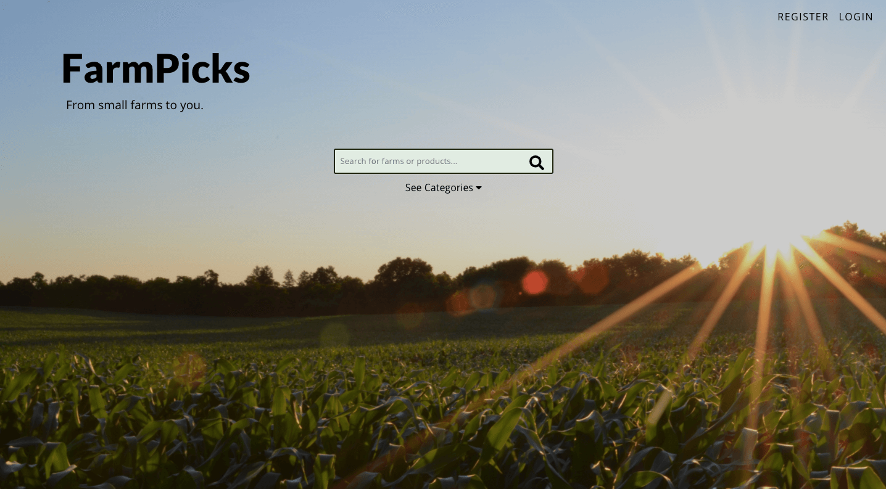
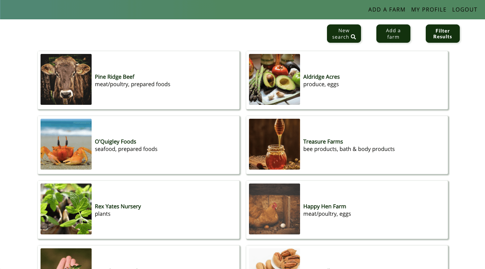
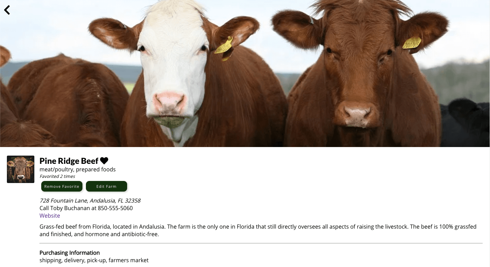

# FarmPicks - From small farms to you.

[FarmPicks](https://farmpicks.vercel.app/) is a directory app that allows users seeking information about local farms to search and browse farms and get information about them. Users can also save farms to their favorites to revisit later, and be part of the community effort to improve existing information about farms.

See FarmPicks in action here: <https://farmpicks.vercel.app/>

## Features
- Search for farms
- View information about farms in the database
- Add and remove farms from a list of favorites
- View list of favorite farms on a User Profile Page
- Add or edit information about farms

## Demo user login

To try the app out, the demo consumer login can be used as follows:

username: consumer1
password: password

## Screenshots

## Built with
- [Create React App](https://github.com/facebook/create-react-app)
- [React-Router](https://reacttraining.com/react-router/)
- CSS

## API
See the FarmPicks API at <https://github.com/rise-erpelding/farmpicks-server>